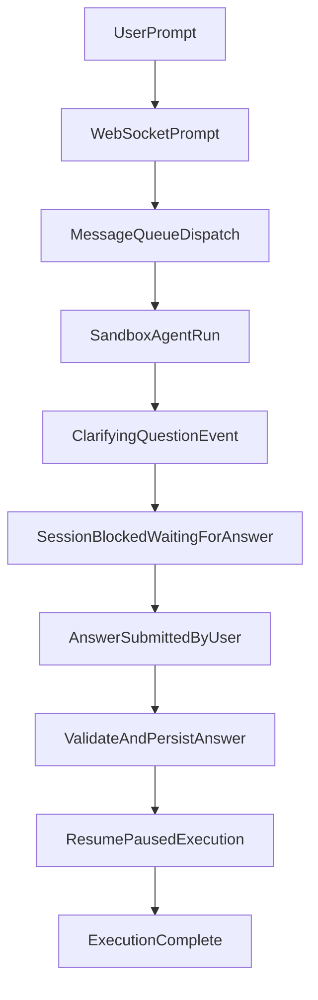

# Implementation Plan: Web App Command + Clarifying Q&A

Date: 2026-02-21 Input: `docs/brainstorms/2026-02-21-web-app-command-clarifying-qa-brainstorm.md`
Status: Ready for engineering execution

## Goal

Implement a Cursor/Claude-like clarifying loop in the web app:

- Slash command recognition (explicit slash syntax only)
- Model-initiated clarifying questions during runs
- Blocking flow until the user answers
- Answer UI for single-choice, multi-select, and optional Other text

## Scope

### In scope

- New event/message contracts for clarifying questions and answers
- Session queue behavior for blocking/resume
- Web app rendering and answer submission UX
- Validation/idempotency for required answers

### Out of scope

- MCP setup, provider management, and capability registry UX
- Skip/defer question behavior
- Question-count policy controls

## Existing Architecture Touchpoints

- WebSocket client state and event handling: `packages/web/src/hooks/use-session-socket.ts`
- Session page input/rendering orchestration: `packages/web/src/app/(app)/session/[id]/page.tsx`
- Session message routing and internal endpoints:
  `packages/control-plane/src/session/durable-object.ts`
- Prompt queue state and dispatch behavior: `packages/control-plane/src/session/message-queue.ts`
- Shared event/message typing: `packages/shared/src/types/index.ts`

## Proposed Runtime Flow

## Event and Message Contract Additions

### A) Server -> Client event

- Add `clarifying_question` sandbox event payload with:
  - `questionId: string`
  - `messageId: string`
  - `prompt: string`
  - `mode: "single" | "multi"`
  - `options: Array<{ id: string; label: string; allowOther?: boolean }>`
  - `required: true`
  - `timestamp: number`

### B) Client -> Server command

- Add `answer_clarifying_question` client message payload with:
  - `questionId: string`
  - `messageId: string`
  - `selectedOptionIds: string[]`
  - `otherText?: string`

### C) Server -> Client lifecycle updates

- Extend processing state updates to represent blocked execution:
  - `processing_status` with `isProcessing: true` plus `blockedReason: "awaiting_user_answer"` (or
    equivalent explicit flag)
- Emit answer acceptance/rejection feedback:
  - Accepted: answer echoed into event stream and run resumes
  - Rejected/stale: structured error event for client recovery UX

## Backend Work Plan

1. **Shared types**
   - Extend `packages/shared/src/types/index.ts` with:
     - new sandbox event union for `clarifying_question`
     - new client message type for `answer_clarifying_question`
     - optional blocked status metadata
2. **Durable Object routing**
   - In `packages/control-plane/src/session/durable-object.ts`:
     - handle new client message type
     - add internal endpoint and/or direct handler to persist answer and unblock processing
3. **Queue state transitions**
   - In `packages/control-plane/src/session/message-queue.ts`:
     - introduce explicit blocked state for active message when question is pending
     - prevent new prompt dispatch while blocked on required answer
     - resume dispatch path once answer is accepted
4. **Event processing**
   - In control plane sandbox event processing path, persist and broadcast `clarifying_question`
   - ensure reconnect/history replay includes pending question state
5. **Idempotency**
   - enforce first-valid-answer-wins for a pending `questionId`
   - duplicate submissions return deterministic response without re-resuming twice

## Frontend Work Plan

1. **Socket hook support**
   - In `packages/web/src/hooks/use-session-socket.ts`:
     - parse/store `clarifying_question` events as first-class state
     - expose `submitClarifyingAnswer(...)` API from hook
     - handle blocked processing indicators
2. **Session UI components**
   - In `packages/web/src/app/(app)/session/[id]/page.tsx` (and new components as needed):
     - render pending question card inline with session timeline
     - support single-choice, multi-select, and Other text inputs
     - enforce required-answer validation
3. **Input/interaction rules**
   - while blocked, disable conflicting actions that could create duplicate execution paths
   - show clear “waiting for your answer” status and post-submit “resuming…” feedback

## Slash Command Work Plan

1. Add slash command parser in web input submit path:
   - detect command token at prompt start
   - validate against v1 whitelist: `/plan`, `/explain`, `/debug`, `/refactor`, `/test`
2. Send command metadata with prompt payload (non-breaking optional field)
3. Show user-facing validation for unsupported commands
4. Preserve current behavior for non-slash prompts

## Acceptance Test Checklist

- [ ] Supported slash command is recognized and prompt is accepted
- [ ] Unsupported slash command returns immediate validation error
- [ ] Agent emits clarifying question and run blocks
- [ ] User can submit valid single-choice answer and run resumes
- [ ] User can submit valid multi-select answer and run resumes
- [ ] Other text field validates when selected
- [ ] Empty answer cannot be submitted
- [ ] Reload/reconnect restores pending question and blocked state
- [ ] Duplicate answer submits do not double-resume execution
- [ ] Existing non-question flows still behave as before

## Sequencing Recommendation

1. Shared contracts and event typing
2. Durable Object + queue blocked/resume behavior
3. Frontend pending-question UI and answer submit path
4. Slash command recognition and validation
5. Replay/reconnect hardening and idempotency checks

## Risks and Mitigations

- **Risk:** blocked-state deadlocks
  - **Mitigation:** explicit state transition guards and stale-question error handling
- **Risk:** backward compatibility with existing clients
  - **Mitigation:** additive message fields and tolerant parsing
- **Risk:** duplicate user actions
  - **Mitigation:** server-side idempotency keyed by `questionId` and pending-state check
